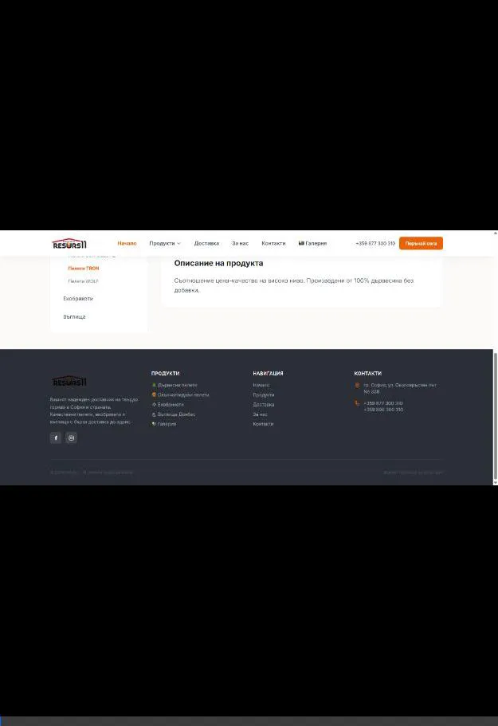
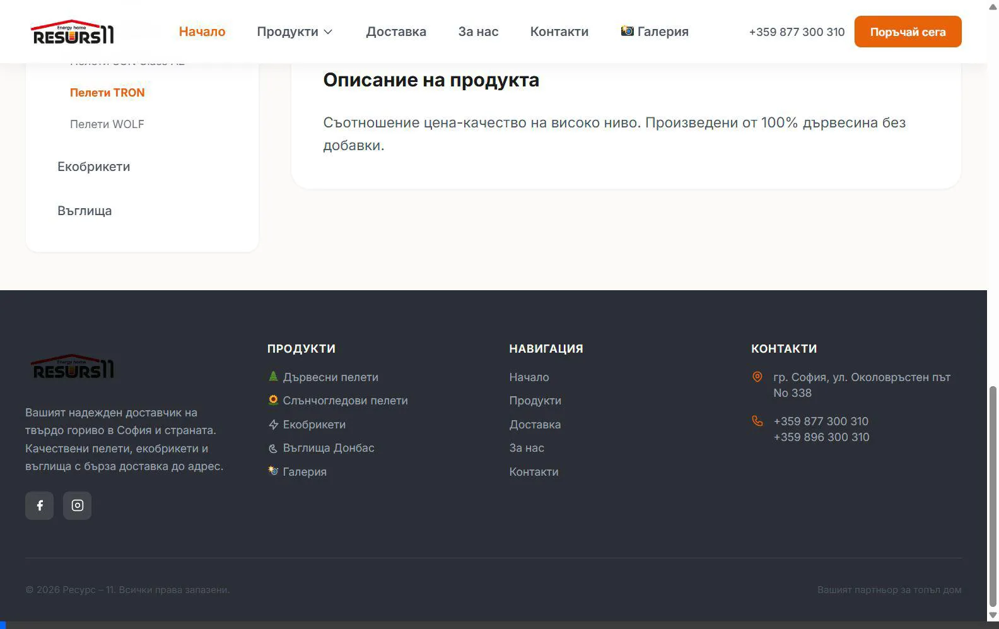

# 🔥 Ресурс 11 – Custom WordPress Website

[](https://resurs11.com)

**Ресурс 11** е потребителски WordPress уебсайт за локален бизнес в София, България, специализиран в продажбата и доставката на **твърдо гориво** – дървесни и слънчогледови пелети, екобрикети и въглища. Сайтът е разработен с фокус върху бързина, мобилен UX и локално SEO.

🌐 **Реален домейн:** [https://resurs11.com](https://resurs11.com)

---

## 🛠 Tech Stack

| Технология | Описание |
|---|---|
| **CMS** | WordPress |
| **Backend** | PHP (Custom Theme / Templates) |
| **Styling** | Tailwind CSS (CDN) |
| **Scripts** | JavaScript (Vanilla JS за анимации и интеракции) |
| **Data** | Advanced Custom Fields (ACF) за динамично съдържание |

---

## ✨ Ключови функционалности

- **Custom Post Types (CPT)** – Изцяло къстъм продуктова структура (`produkt`) с категории (`produkt_kategoria`) за организиране на пелети, екобрикети и въглища.
- **Динамична галерия** – Страница „Галерия" с филтри (Склад / Доставка) и Lightbox ефект за разглеждане на снимки без презареждане.
- **Оптимизиран мобилен UX** – Интерактивен бутон „Виж други продукти" на мобилни устройства, който замества традиционния сайдбар за по-добър UX (акордеон ефект).
- **Двойни цени** – Автоматизирано показване на цени в EUR и BGN (на тон и на чувал) чрез ACF полета.
- **SEO оптимизация** – Мета тагове, Alt текстове на снимките и Schema-ready структура за по-добро класиране в търсачките.
- **Scroll Reveal анимации** – Плавни анимации при скрол на секциите на началната страница.
- **Responsive дизайн** – Пълна адаптивност за мобилни устройства, таблети и десктоп.

---

## 📁 Структура на темата

```
resurs11-theme/
├── style.css                         # Тема метаданни
├── header.php                        # Хедър с навигация и мобилно меню
├── footer.php                        # Футър с контакти и линкове
├── front-page.php                    # Начална страница (Hero, секции)
├── index.php                         # Fallback шаблон
│
├── single-produkt.php                # Единична продуктова страница (CPT)
├── taxonomy-produkt_kategoria.php    # Архив по категория продукт
├── page-produkti.php                 # Каталог – всички продукти
├── page-peleti.php                   # Категория Пелети
├── page-ekobriketi.php               # Категория Екобрикети
├── page-vaglishta.php                # Категория Въглища
│
├── page-peleti-schnider.php          # Продуктови детайли (по един за всеки продукт)
├── page-peleti-holz.php
├── page-peleti-ahira.php
├── page-peleti-wolf.php
├── page-peleti-tron.php
├── page-peleti-pjs.php
├── page-peleti-eco.php
├── page-peleti-kerpi.php
├── page-peleti-brevis.php
├── page-peleti-sun-a1.php
├── page-peleti-sun-a2.php
├── page-ekobriket-ruf.php
├── page-ekobriket-slunshogled.php
├── page-ekobriket-resurs.php
├── page-vaglishta-donbas.php
│
├── page-galeriya.php                 # Галерия с филтри и Lightbox
├── page-dostavka.php                 # Страница Доставка
├── page-za-nas.php                   # За нас
├── page-kontakti.php                 # Контакти (форма за запитване)
│
└── images/                           # Продуктови снимки и фонови изображения
```

---

## 🎥 Демо

### Сцена 1: Начална страница (Desktop)
Зареждане на началната страница, scroll reveal анимации, footer.


### Сцена 2: Продукти и Категории (Desktop)
Навигация до продуктовата страница, избор на продукт, детайлна страница със сайдбар.


### Сцена 3: Мобилен UX
Мобилен изглед на продуктовата страница, акордеон бутон „Виж други продукти".



### Сцена 4: Галерия
Филтри „Склад" / „Доставка" с динамично сортиране и Lightbox ефект.


### Сцена 5: Контакти
Форма за запитване, локация и контактни данни.



---

## 📞 Контакти

- **Телефон:** +359 877 300 310 / +359 896 300 310
- **Адрес:** район Панчерево, ул. Околовръстен път No 338, София
- **Facebook:** [Ресурс 11](https://www.facebook.com/resurs11)
- **Instagram:** [@resurs_11](https://instagram.com/resurs_11)

---

<p align="center">© 2026 Ресурс – 11. Всички права запазени.</p>
